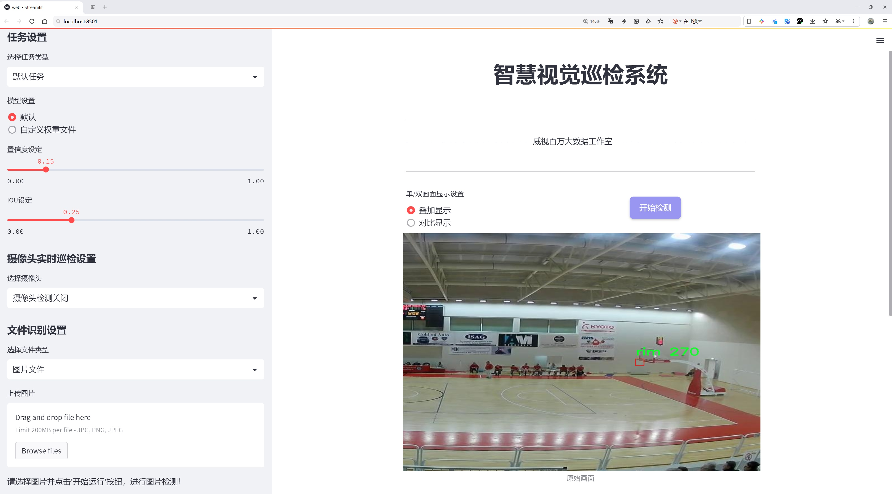
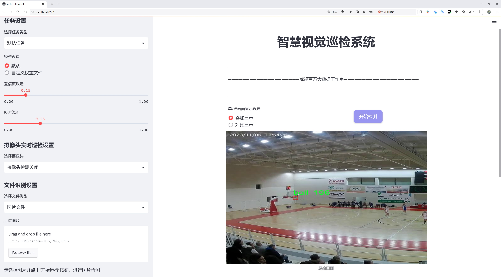
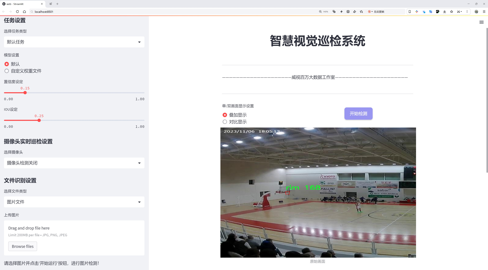
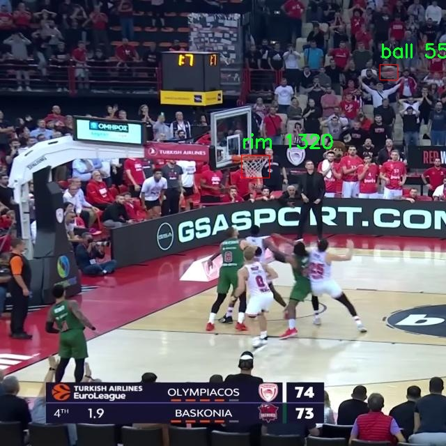
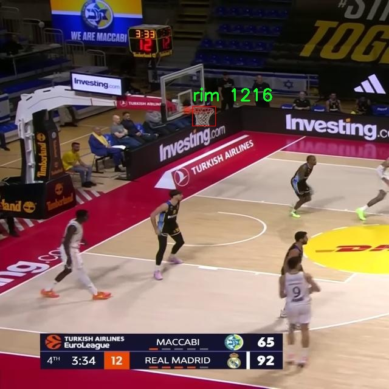
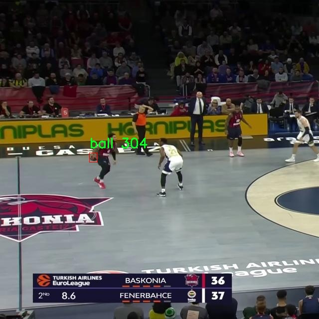
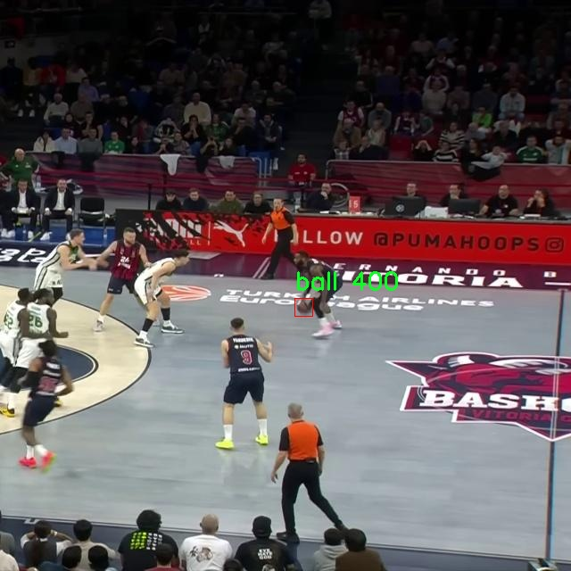
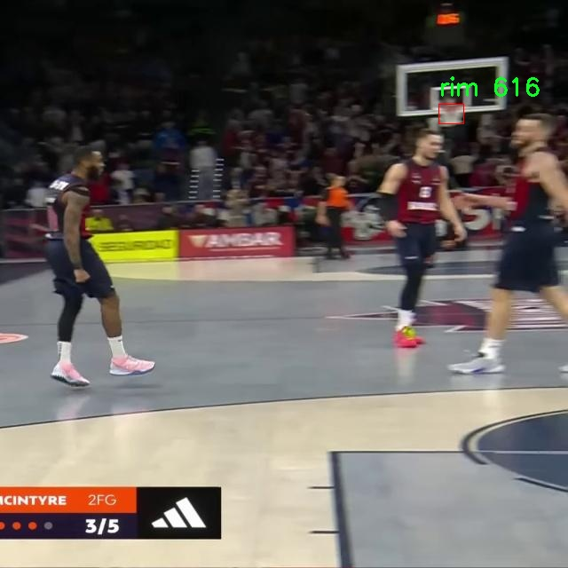

# 篮球和篮筐检测检测系统源码分享
 # [一条龙教学YOLOV8标注好的数据集一键训练_70+全套改进创新点发刊_Web前端展示]

### 1.研究背景与意义

项目参考[AAAI Association for the Advancement of Artificial Intelligence](https://gitee.com/qunshansj/projects)

项目来源[AACV Association for the Advancement of Computer Vision](https://gitee.com/qunmasj/projects)

研究背景与意义

篮球作为一项全球广泛受欢迎的运动，其比赛过程中的动态表现和战术安排都离不开对球场上关键元素的精准识别与分析。近年来，随着计算机视觉技术的快速发展，基于深度学习的目标检测算法在体育赛事分析中得到了广泛应用。其中，YOLO（You Only Look Once）系列模型因其高效的实时检测能力而受到研究者和实践者的青睐。YOLOv8作为该系列的最新版本，结合了更为先进的特征提取和处理机制，为复杂场景下的目标检测提供了更为可靠的解决方案。

在篮球比赛中，球和篮筐是两个至关重要的目标，准确识别它们对于比赛分析、战术研究以及裁判判罚都有着重要的意义。传统的篮球视频分析方法往往依赖于人工标注和经验判断，效率低下且容易受到主观因素的影响。而基于YOLOv8的篮球和篮筐检测系统，能够通过对视频数据的自动化处理，实现对比赛中球和篮筐的实时检测与跟踪。这不仅提高了分析的效率，还为教练员和运动员提供了数据支持，帮助他们更好地理解比赛动态，优化战术安排。

本研究所使用的数据集包含6000张图像，涵盖了篮球比赛中球和篮筐的多种场景与角度。这一数据集的丰富性为模型的训练和验证提供了坚实的基础，使得模型能够在不同的光照、背景和运动状态下保持较高的检测精度。此外，数据集中还包含了四个类别的标注信息，确保了模型在多样化场景下的适应性与鲁棒性。

通过对YOLOv8模型的改进，本研究旨在提升篮球和篮筐的检测精度与速度。具体而言，我们将探讨如何通过数据增强、模型结构优化和超参数调节等手段，进一步提升模型在复杂环境下的表现。这一研究不仅具有理论价值，也为实际应用提供了切实可行的解决方案，推动了体育视频分析技术的发展。

在体育科学与技术的交叉领域，基于深度学习的目标检测系统为数据驱动的决策提供了新的可能性。通过对篮球比赛中关键目标的自动检测与分析，我们能够更深入地理解运动员的表现、比赛的节奏以及战术的有效性。这不仅为教练员和运动员提供了重要的反馈信息，也为体育科研提供了新的数据来源，促进了篮球运动的科学化与专业化发展。

综上所述，基于改进YOLOv8的篮球和篮筐检测系统的研究，不仅具有重要的学术价值，也为实际应用提供了新的思路与方法。通过提升目标检测的精度与效率，我们期望能够为篮球运动的分析与发展贡献一份力量，推动这一领域的进一步研究与探索。

### 2.图片演示







##### 注意：由于此博客编辑较早，上面“2.图片演示”和“3.视频演示”展示的系统图片或者视频可能为老版本，新版本在老版本的基础上升级如下：（实际效果以升级的新版本为准）

  （1）适配了YOLOV8的“目标检测”模型和“实例分割”模型，通过加载相应的权重（.pt）文件即可自适应加载模型。

  （2）支持“图片识别”、“视频识别”、“摄像头实时识别”三种识别模式。

  （3）支持“图片识别”、“视频识别”、“摄像头实时识别”三种识别结果保存导出，解决手动导出（容易卡顿出现爆内存）存在的问题，识别完自动保存结果并导出到tempDir中。

  （4）支持Web前端系统中的标题、背景图等自定义修改，后面提供修改教程。

  另外本项目提供训练的数据集和训练教程,暂不提供权重文件（best.pt）,需要您按照教程进行训练后实现图片演示和Web前端界面演示的效果。

### 3.视频演示

[3.1 视频演示](https://www.bilibili.com/video/BV12B4Be1EGX/)

### 4.数据集信息展示

##### 4.1 本项目数据集详细数据（类别数＆类别名）

nc: 2
names: ['ball', 'rim']


##### 4.2 本项目数据集信息介绍

数据集信息展示

在篮球运动的分析与研究中，视频数据的处理与理解至关重要。为此，我们构建了一个名为“Basketball Video Analysis”的数据集，旨在为改进YOLOv8的篮球和篮筐检测系统提供高质量的训练数据。该数据集专注于篮球比赛中的两个主要目标：篮球（ball）和篮筐（rim），这两个类别的选择不仅符合篮球运动的核心元素，也为后续的智能分析和自动化裁判系统奠定了基础。

“Basketball Video Analysis”数据集包含丰富的篮球比赛视频片段，涵盖了不同场景、角度和光照条件下的比赛情况。这些视频片段经过精心挑选，确保能够代表篮球比赛中各种可能出现的动态场景。数据集中包含的篮球和篮筐图像样本，均经过专业标注，确保每个目标的边界框准确无误。这种高质量的标注为YOLOv8模型的训练提供了可靠的基础，使其能够在复杂的比赛环境中有效识别和定位篮球及篮筐。

在数据集的构建过程中，我们注重多样性与代表性。篮球比赛的不同阶段，如投篮、传球、抢篮板等，都被充分考虑在内。每个视频片段不仅展示了篮球和篮筐的静态特征，还捕捉了运动中的动态变化，这为模型的训练提供了丰富的上下文信息。通过这种方式，YOLOv8能够学习到在不同情境下如何快速而准确地识别目标，从而提高其在实际应用中的表现。

数据集的类别数量为2，分别是“ball”和“rim”。这两个类别的选择是基于篮球比赛的基本构成，篮球作为比赛的核心物体，篮筐则是比赛得分的关键目标。通过对这两个类别的深入分析，我们可以实现对比赛过程的全面理解。例如，检测篮球的运动轨迹可以帮助分析投篮的成功率，而对篮筐的检测则可以用于评估球员的投篮精准度。这种细致的分析不仅有助于教练和运动员进行战术调整，也为数据驱动的体育科学研究提供了支持。

此外，数据集还包含了多种数据增强技术的应用，如旋转、缩放、翻转等，旨在提升模型的泛化能力。通过这些技术，我们能够在有限的样本上模拟出更多的训练场景，使得YOLOv8在面对不同类型的篮球比赛时，依然能够保持高效的检测性能。这种增强不仅提升了模型的鲁棒性，也为其在实际应用中的灵活性提供了保障。

总之，“Basketball Video Analysis”数据集为改进YOLOv8的篮球和篮筐检测系统提供了一个坚实的基础。通过丰富的样本、多样的场景以及高质量的标注，该数据集不仅为模型的训练提供了必要的数据支持，也为未来的篮球运动分析与研究开辟了新的方向。随着技术的不断进步，我们期待这一数据集能够在智能体育分析领域发挥更大的作用，推动篮球运动的科学化与智能化发展。











### 5.全套项目环境部署视频教程（零基础手把手教学）

[5.1 环境部署教程链接（零基础手把手教学）](https://www.ixigua.com/7404473917358506534?logTag=c807d0cbc21c0ef59de5)


[5.2 安装Python虚拟环境创建和依赖库安装视频教程链接（零基础手把手教学）](https://www.ixigua.com/7404474678003106304?logTag=1f1041108cd1f708b01a)

### 6.手把手YOLOV8训练视频教程（零基础小白有手就能学会）

[6.1 手把手YOLOV8训练视频教程（零基础小白有手就能学会）](https://www.ixigua.com/7404477157818401292?logTag=d31a2dfd1983c9668658)

### 7.70+种全套YOLOV8创新点代码加载调参视频教程（一键加载写好的改进模型的配置文件）

[7.1 70+种全套YOLOV8创新点代码加载调参视频教程（一键加载写好的改进模型的配置文件）](https://www.ixigua.com/7404478314661806627?logTag=29066f8288e3f4eea3a4)

### 8.70+种全套YOLOV8创新点原理讲解（非科班也可以轻松写刊发刊，V10版本正在科研待更新）

由于篇幅限制，每个创新点的具体原理讲解就不一一展开，具体见下列网址中的创新点对应子项目的技术原理博客网址【Blog】：


[8.1 70+种全套YOLOV8创新点原理讲解链接](https://gitee.com/qunmasj/good)

### 9.系统功能展示（检测对象为举例，实际内容以本项目数据集为准）

图9.1.系统支持检测结果表格显示

  图9.2.系统支持置信度和IOU阈值手动调节

  图9.3.系统支持自定义加载权重文件best.pt(需要你通过步骤5中训练获得)

  图9.4.系统支持摄像头实时识别

  图9.5.系统支持图片识别

  图9.6.系统支持视频识别

  图9.7.系统支持识别结果文件自动保存

  图9.8.系统支持Excel导出检测结果数据


### 10.原始YOLOV8算法原理

原始YOLOv8算法原理

YOLOv8作为计算机视觉领域最新的目标检测与实例分割模型，自2023年1月10日发布以来，迅速成为了众多研究者和开发者关注的焦点。它在精度和执行时间方面的卓越表现，使其在各类应用场景中展现出强大的能力。YOLOv8不仅继承了YOLO系列的优良传统，还在此基础上进行了全面的创新与改进，尤其是在模型结构、损失函数和特征融合等方面。

首先，YOLOv8的骨干网络采用了CSPDarknet的思想，这一设计灵感源自于YOLOv5，但在实现上进行了显著的优化。YOLOv8将YOLOv5中的C3模块替换为C2f模块，C2f模块的设计充分考虑了特征的重用和梯度流的优化。C2f模块通过引入ELAN（Efficient Layer Aggregation Network）思想，增强了网络的特征提取能力。该模块由多个CBS（卷积+归一化+SiLU激活）和BottleNeck结构组成，能够有效地缓解深层网络中的梯度消失问题，同时保持特征图的维度一致性，确保了信息的充分流动。

在特征融合方面，YOLOv8采用了PAN-FPN（Path Aggregation Network with Feature Pyramid Network）结构。这一结构的设计旨在通过多尺度特征的深度融合，提升模型对不同尺寸目标的检测能力。YOLOv8的Neck部分在此基础上进行了优化，取消了YOLOv5中上采样阶段的1x1卷积，直接将高层特征与中层特征进行拼接，确保了特征信息的完整性与准确性。这种自下而上的特征融合方式，使得YOLOv8能够更好地捕捉到目标的细节信息和语义信息，从而提升检测的精度。

YOLOv8的检测头设计也发生了显著变化。传统的Anchor-Based方法被Anchor-Free的检测头所取代，简化了模型的复杂性。YOLOv8的解耦头结构仅包含分类和回归两个分支，去除了以往的objectness分支，进一步提高了模型的灵活性和可扩展性。分类分支使用了BCELoss，而回归分支则结合了Distribution Focal Loss和CIoULoss，确保了在处理小目标和高分辨率图像时的高效性和准确性。

值得一提的是，YOLOv8在样本匹配策略上也进行了创新，采用了Task-Aligned的Assigner匹配方式，替代了以往的静态匹配。这一策略使得模型在训练过程中能够更好地适应不同任务的需求，提高了样本利用率和模型的学习效率。

在数据预处理方面，YOLOv8延续了YOLOv5的策略，采用了马赛克增强、混合增强、空间扰动和颜色扰动等多种增强手段，以提升模型的鲁棒性和泛化能力。通过将输入图像转换为640x640的RGB图像，YOLOv8能够有效地提取目标的纹理和颜色特征，进而实现高效的目标检测。

YOLOv8的整体架构设计充分考虑了实时性与准确性的平衡，采用了简洁而高效的网络结构，使得其在各种硬件平台上均能流畅运行。这一设计理念不仅延续了YOLO系列的工程化优势，还为实际应用提供了极大的便利。

总的来说，YOLOv8在目标检测领域的成功，不仅得益于其在模型结构上的创新与优化，更在于其对实际应用需求的深刻理解与响应。通过引入新的骨干网络、解耦头和损失函数，YOLOv8实现了对小目标和高分辨率图像的有效检测，进一步推动了计算机视觉技术的发展。随着YOLOv8的不断应用与推广，未来在智能监控、自动驾驶、无人机等领域的应用前景将更加广阔。


### 11.项目核心源码讲解（再也不用担心看不懂代码逻辑）

#### 11.1 70+种YOLOv8算法改进源码大全和调试加载训练教程（非必要）\ultralytics\engine\validator.py

以下是经过简化和注释的核心代码部分，主要保留了 `BaseValidator` 类的结构和重要方法，去掉了不必要的细节和注释。

```python
import json
import time
from pathlib import Path
import numpy as np
import torch
from ultralytics.cfg import get_cfg, get_save_dir
from ultralytics.nn.autobackend import AutoBackend
from ultralytics.utils import LOGGER, TQDM, callbacks
from ultralytics.utils.checks import check_imgsz
from ultralytics.utils.ops import Profile
from ultralytics.utils.torch_utils import select_device, smart_inference_mode

class BaseValidator:
    """
    BaseValidator 类用于创建验证器的基类。
    """

    def __init__(self, dataloader=None, save_dir=None, pbar=None, args=None, _callbacks=None):
        """
        初始化 BaseValidator 实例。

        参数:
            dataloader: 用于验证的数据加载器。
            save_dir: 结果保存目录。
            pbar: 进度条。
            args: 验证器的配置。
            _callbacks: 回调函数字典。
        """
        self.args = get_cfg(overrides=args)  # 获取配置
        self.dataloader = dataloader  # 数据加载器
        self.pbar = pbar  # 进度条
        self.model = None  # 模型
        self.device = None  # 设备
        self.batch_i = None  # 当前批次索引
        self.training = True  # 是否在训练模式
        self.save_dir = save_dir or get_save_dir(self.args)  # 保存目录
        self.speed = {'preprocess': 0.0, 'inference': 0.0, 'loss': 0.0, 'postprocess': 0.0}  # 速度统计

        # 创建保存目录
        (self.save_dir / 'labels' if self.args.save_txt else self.save_dir).mkdir(parents=True, exist_ok=True)
        self.args.imgsz = check_imgsz(self.args.imgsz, max_dim=1)  # 检查图像尺寸

        self.callbacks = _callbacks or callbacks.get_default_callbacks()  # 获取回调函数

    @smart_inference_mode()
    def __call__(self, trainer=None, model=None):
        """
        支持验证预训练模型或正在训练的模型。
        """
        self.training = trainer is not None  # 判断是否在训练模式
        if self.training:
            self.device = trainer.device  # 获取设备
            model = trainer.ema.ema or trainer.model  # 获取模型
            model.eval()  # 设置模型为评估模式
        else:
            model = AutoBackend(model or self.args.model, device=select_device(self.args.device, self.args.batch))
            self.device = model.device  # 更新设备
            self.dataloader = self.dataloader or self.get_dataloader(self.args.data, self.args.batch)  # 获取数据加载器
            model.eval()  # 设置模型为评估模式

        # 记录速度
        dt = Profile(), Profile(), Profile(), Profile()
        bar = TQDM(self.dataloader, desc='Validating', total=len(self.dataloader))  # 进度条
        for batch_i, batch in enumerate(bar):
            # 预处理
            with dt[0]:
                batch = self.preprocess(batch)

            # 推理
            with dt[1]:
                preds = model(batch['img'])

            # 更新指标
            self.update_metrics(preds, batch)

        # 计算速度
        self.speed = dict(zip(self.speed.keys(), (x.t / len(self.dataloader.dataset) * 1E3 for x in dt)))
        self.print_results()  # 打印结果

    def preprocess(self, batch):
        """预处理输入批次。"""
        return batch

    def update_metrics(self, preds, batch):
        """根据预测和批次更新指标。"""
        pass

    def print_results(self):
        """打印模型预测的结果。"""
        pass

    def get_dataloader(self, dataset_path, batch_size):
        """从数据集路径和批量大小获取数据加载器。"""
        raise NotImplementedError('get_dataloader function not implemented for this validator')
```

### 代码说明
1. **类的定义**: `BaseValidator` 是一个基类，用于实现模型验证的基本功能。
2. **初始化方法**: 在 `__init__` 方法中，初始化了配置、数据加载器、保存目录等属性，并创建了必要的目录。
3. **调用方法**: `__call__` 方法支持验证预训练模型或正在训练的模型，包含了模型的评估模式设置、数据加载和速度统计等。
4. **预处理和更新指标**: `preprocess` 方法用于对输入批次进行预处理，`update_metrics` 方法用于更新模型的性能指标。
5. **打印结果**: `print_results` 方法用于打印模型的预测结果。

以上是代码的核心部分及其功能的详细中文注释。

这个文件是一个YOLOv8模型验证器的实现，主要用于评估模型在测试集或验证集上的准确性。文件中包含了一个名为`BaseValidator`的类，它是进行模型验证的基础类，提供了一系列方法和属性来支持验证过程。

在文件开头，提供了使用说明，用户可以通过命令行调用该验证器，指定模型文件、数据集配置文件以及图像大小等参数。支持多种模型格式，包括PyTorch、TorchScript、ONNX等。

`BaseValidator`类的构造函数初始化了一些关键属性，包括数据加载器、保存结果的目录、进度条、模型配置等。它还会根据用户提供的参数进行一些基本的检查和设置，例如设置默认的置信度阈值和图像大小。

类中最重要的方法是`__call__`，它支持对预训练模型或正在训练的模型进行验证。该方法会根据是否传入训练器对象来决定验证的模式，并设置相应的设备和数据集。它还会处理数据加载、模型推理、损失计算和后处理等步骤。

在验证过程中，使用了进度条来显示当前的处理进度，并通过调用一系列回调函数来支持用户自定义的操作。这些回调函数可以在验证的不同阶段被触发，例如在验证开始、每个批次开始和结束时。

此外，类中还定义了一些用于计算和更新模型性能指标的方法，例如`init_metrics`、`update_metrics`和`finalize_metrics`。这些方法用于初始化、更新和最终化模型的性能统计信息。

文件中还实现了一些辅助功能，例如将预测结果与真实标签进行匹配、将结果保存为JSON格式、绘制验证样本和预测结果等。

总的来说，这个文件提供了一个结构化的框架，用于验证YOLOv8模型的性能，支持多种数据集和模型格式，并提供了灵活的回调机制以便于用户扩展功能。

#### 11.2 ui.py

```python
import sys
import subprocess

def run_script(script_path):
    """
    使用当前 Python 环境运行指定的脚本。

    Args:
        script_path (str): 要运行的脚本路径

    Returns:
        None
    """
    # 获取当前 Python 解释器的路径
    python_path = sys.executable

    # 构建运行命令
    command = f'"{python_path}" -m streamlit run "{script_path}"'

    # 执行命令
    result = subprocess.run(command, shell=True)
    if result.returncode != 0:
        print("脚本运行出错。")


# 实例化并运行应用
if __name__ == "__main__":
    # 指定您的脚本路径
    script_path = "web.py"  # 这里可以直接指定脚本路径

    # 运行脚本
    run_script(script_path)
```

### 代码注释说明：

1. **导入模块**：
   - `import sys`：导入系统相关的模块，用于获取当前 Python 解释器的路径。
   - `import subprocess`：导入子进程模块，用于在 Python 中执行外部命令。

2. **定义 `run_script` 函数**：
   - 该函数接收一个参数 `script_path`，表示要运行的 Python 脚本的路径。
   - 函数内部首先获取当前 Python 解释器的路径，存储在 `python_path` 变量中。
   - 然后构建一个命令字符串 `command`，用于运行指定的脚本，使用 `streamlit` 模块来执行。
   - 使用 `subprocess.run` 方法执行命令，并将 `shell=True` 作为参数，表示在 shell 中执行该命令。
   - 如果命令执行返回的状态码不为 0，表示执行出错，打印错误信息。

3. **主程序入口**：
   - `if __name__ == "__main__":`：确保该代码块仅在脚本作为主程序运行时执行。
   - 指定要运行的脚本路径 `script_path`，这里直接指定为 `"web.py"`。
   - 调用 `run_script` 函数，传入脚本路径，执行该脚本。

这个程序文件的主要功能是通过当前的 Python 环境来运行一个指定的脚本，具体来说是运行一个名为 `web.py` 的脚本。程序首先导入了必要的模块，包括 `sys`、`os` 和 `subprocess`，这些模块分别用于系统操作、路径处理和执行外部命令。

在 `run_script` 函数中，首先获取当前 Python 解释器的路径，这通过 `sys.executable` 实现。接着，构建一个命令字符串，该命令用于调用 `streamlit` 模块来运行指定的脚本。这里使用了 `-m` 参数来指定模块的方式运行，确保 `streamlit` 可以正确找到并执行 `web.py`。

然后，使用 `subprocess.run` 方法来执行构建好的命令。这个方法会在新的 shell 中运行命令，并等待其完成。执行后，程序会检查返回的状态码，如果返回码不为零，表示脚本运行出错，此时会打印出错误信息。

在文件的最后部分，使用 `if __name__ == "__main__":` 语句来确保只有在直接运行该文件时才会执行下面的代码。这里指定了要运行的脚本路径为 `web.py`，并调用 `run_script` 函数来执行该脚本。

总的来说，这个程序的功能是简化了通过命令行运行 `streamlit` 应用的过程，使得用户可以直接通过 Python 脚本来启动指定的 Web 应用。

#### 11.3 70+种YOLOv8算法改进源码大全和调试加载训练教程（非必要）\ultralytics\cfg\__init__.py

以下是代码中最核心的部分，并附上详细的中文注释：

```python
def cfg2dict(cfg):
    """
    将配置对象转换为字典格式，支持文件路径、字符串或SimpleNamespace对象。

    参数:
        cfg (str | Path | dict | SimpleNamespace): 要转换为字典的配置对象。

    返回:
        cfg (dict): 转换后的字典格式配置对象。
    """
    if isinstance(cfg, (str, Path)):
        cfg = yaml_load(cfg)  # 从文件加载字典
    elif isinstance(cfg, SimpleNamespace):
        cfg = vars(cfg)  # 将SimpleNamespace转换为字典
    return cfg


def get_cfg(cfg: Union[str, Path, Dict, SimpleNamespace] = DEFAULT_CFG_DICT, overrides: Dict = None):
    """
    从文件或字典加载并合并配置数据。

    参数:
        cfg (str | Path | Dict | SimpleNamespace): 配置数据。
        overrides (str | Dict | optional): 覆盖配置的文件名或字典。默认为None。

    返回:
        (SimpleNamespace): 训练参数的命名空间。
    """
    cfg = cfg2dict(cfg)

    # 合并覆盖配置
    if overrides:
        overrides = cfg2dict(overrides)
        if 'save_dir' not in cfg:
            overrides.pop('save_dir', None)  # 忽略特殊覆盖键
        check_dict_alignment(cfg, overrides)
        cfg = {**cfg, **overrides}  # 合并cfg和覆盖字典（优先使用覆盖）

    # 特殊处理数字类型的项目/名称
    for k in 'project', 'name':
        if k in cfg and isinstance(cfg[k], (int, float)):
            cfg[k] = str(cfg[k])
    if cfg.get('name') == 'model':  # 将模型名称赋值给'name'参数
        cfg['name'] = cfg.get('model', '').split('.')[0]
        LOGGER.warning(f"WARNING ⚠️ 'name=model' 自动更新为 'name={cfg['name']}'.")

    # 类型和值检查
    for k, v in cfg.items():
        if v is not None:  # None值可能来自可选参数
            if k in CFG_FLOAT_KEYS and not isinstance(v, (int, float)):
                raise TypeError(f"'{k}={v}' 的类型 {type(v).__name__} 无效. "
                                f"有效的 '{k}' 类型是 int（例如 '{k}=0'）或 float（例如 '{k}=0.5'）")
            elif k in CFG_FRACTION_KEYS:
                if not isinstance(v, (int, float)):
                    raise TypeError(f"'{k}={v}' 的类型 {type(v).__name__} 无效. "
                                    f"有效的 '{k}' 类型是 int（例如 '{k}=0'）或 float（例如 '{k}=0.5'）")
                if not (0.0 <= v <= 1.0):
                    raise ValueError(f"'{k}={v}' 的值无效. "
                                     f"有效的 '{k}' 值在 0.0 和 1.0 之间。")
            elif k in CFG_INT_KEYS and not isinstance(v, int):
                raise TypeError(f"'{k}={v}' 的类型 {type(v).__name__} 无效. "
                                f"'{k}' 必须是 int（例如 '{k}=8'）")
            elif k in CFG_BOOL_KEYS and not isinstance(v, bool):
                raise TypeError(f"'{k}={v}' 的类型 {type(v).__name__} 无效. "
                                f"'{k}' 必须是 bool（例如 '{k}=True' 或 '{k}=False'）")

    # 返回命名空间实例
    return IterableSimpleNamespace(**cfg)


def entrypoint(debug=''):
    """
    该函数是ultralytics包的入口点，负责解析传递给包的命令行参数。

    该函数允许：
    - 传递强制性的YOLO参数作为字符串列表
    - 指定要执行的任务，如'detect'、'segment'或'classify'
    - 指定模式，如'train'、'val'、'test'或'predict'
    - 运行特殊模式，如'checks'
    - 向包的配置传递覆盖参数

    它使用包的默认配置并使用传递的覆盖进行初始化。
    然后调用CLI函数，传递组合的配置。
    """
    args = (debug.split(' ') if debug else sys.argv)[1:]
    if not args:  # 没有传递参数
        LOGGER.info(CLI_HELP_MSG)
        return

    # 处理特殊命令
    special = {
        'help': lambda: LOGGER.info(CLI_HELP_MSG),
        'checks': checks.collect_system_info,
        'version': lambda: LOGGER.info(__version__),
        'settings': lambda: handle_yolo_settings(args[1:]),
        'cfg': lambda: yaml_print(DEFAULT_CFG_PATH),
        'hub': lambda: handle_yolo_hub(args[1:]),
        'login': lambda: handle_yolo_hub(args),
        'copy-cfg': copy_default_cfg}
    
    # 创建完整的参数字典
    full_args_dict = {**DEFAULT_CFG_DICT, **{k: None for k in TASKS}, **{k: None for k in MODES}, **special}

    # 处理参数并合并覆盖
    overrides = {}  # 基本覆盖，例如 imgsz=320
    for a in merge_equals_args(args):  # 合并等号周围的空格
        if '=' in a:
            try:
                k, v = parse_key_value_pair(a)
                overrides[k] = v
            except (NameError, SyntaxError, ValueError, AssertionError) as e:
                check_dict_alignment(full_args_dict, {a: ''}, e)

        elif a in TASKS:
            overrides['task'] = a
        elif a in MODES:
            overrides['mode'] = a
        elif a.lower() in special:
            special[a.lower()]()
            return
        else:
            check_dict_alignment(full_args_dict, {a: ''})

    # 检查键的对齐
    check_dict_alignment(full_args_dict, overrides)

    # 处理模式和任务
    mode = overrides.get('mode', DEFAULT_CFG.mode or 'predict')
    task = overrides.pop('task', None)

    # 根据模式和任务运行模型
    model = YOLO(overrides.pop('model', DEFAULT_CFG.model), task=task)
    getattr(model, mode)(**overrides)  # 使用模型的默认参数运行命令

    # 显示帮助信息
    LOGGER.info(f'💡 了解更多信息请访问 https://docs.ultralytics.com/modes/{mode}')
```

### 代码说明
1. **cfg2dict**: 将配置对象转换为字典格式，支持多种输入类型。
2. **get_cfg**: 加载和合并配置数据，进行类型和值的检查，确保配置的有效性。
3. **entrypoint**: 作为程序的入口点，解析命令行参数，处理特殊命令，执行模型的训练、验证或预测等操作。

这个程序文件是Ultralytics YOLO（You Only Look Once）系列模型的一个初始化脚本，主要用于配置和处理YOLOv8模型的命令行接口（CLI）参数。文件中包含了多个功能模块，旨在支持模型的训练、验证、预测、导出等操作。

首先，文件导入了一些必要的库和模块，包括上下文管理、文件操作、路径处理、类型定义等。接着，定义了一些有效的任务和模式，包括训练（train）、验证（val）、预测（predict）、导出（export）、跟踪（track）和基准测试（benchmark），以及对应的任务类型，如检测（detect）、分割（segment）、分类（classify）和姿态估计（pose）。每种任务都有其对应的数据集、模型和评估指标。

文件中还包含了一个CLI帮助信息字符串，提供了关于如何使用YOLO命令的详细说明，包括示例命令和参数的用法。用户可以通过命令行输入不同的参数来执行特定的任务。

在配置管理方面，文件定义了一些用于类型检查的键，包括浮点数、整数和布尔值类型的键。这些键用于确保用户输入的参数类型正确，避免因类型不匹配而导致的错误。

`cfg2dict`函数用于将配置对象转换为字典格式，支持文件路径、字符串、字典和SimpleNamespace对象。`get_cfg`函数则用于加载和合并配置数据，可以从文件或字典中读取配置，并支持覆盖默认配置。

`get_save_dir`函数用于生成保存目录，确保训练或验证结果能够被妥善保存。`_handle_deprecation`函数处理已弃用的配置键，确保向后兼容性。

`check_dict_alignment`函数用于检查自定义配置与基础配置之间的键是否匹配，确保用户输入的参数是有效的。`merge_equals_args`函数则用于合并参数列表中的等号分隔的参数，确保参数格式正确。

`handle_yolo_hub`和`handle_yolo_settings`函数分别处理与Ultralytics HUB相关的命令和YOLO设置管理命令。`parse_key_value_pair`函数用于解析键值对参数，`smart_value`函数则将字符串转换为相应的基本数据类型。

`entrypoint`函数是程序的入口点，负责解析命令行参数并根据用户输入执行相应的操作。它支持多种模式和任务，能够根据用户输入的参数调用相应的模型方法。

最后，文件还定义了一个特殊模式的函数`copy_default_cfg`，用于复制默认配置文件并创建一个新的配置文件，以便用户进行自定义设置。

总的来说，这个文件是YOLOv8模型命令行工具的核心部分，提供了灵活的配置和强大的功能，使得用户能够方便地使用YOLO模型进行各种计算机视觉任务。

#### 11.4 code\ultralytics\models\yolo\classify\predict.py

以下是经过简化和注释的核心代码部分：

```python
import cv2
import torch
from PIL import Image
from ultralytics.engine.predictor import BasePredictor
from ultralytics.engine.results import Results
from ultralytics.utils import ops

class ClassificationPredictor(BasePredictor):
    """
    继承自 BasePredictor 类，用于基于分类模型进行预测的类。
    """

    def __init__(self, cfg=DEFAULT_CFG, overrides=None, _callbacks=None):
        """初始化 ClassificationPredictor，将任务设置为 'classify'。"""
        super().__init__(cfg, overrides, _callbacks)  # 调用父类构造函数
        self.args.task = "classify"  # 设置任务类型为分类
        self._legacy_transform_name = "ultralytics.yolo.data.augment.ToTensor"  # 旧版转换名称

    def preprocess(self, img):
        """将输入图像转换为模型兼容的数据类型。"""
        if not isinstance(img, torch.Tensor):  # 如果输入不是张量
            is_legacy_transform = any(
                self._legacy_transform_name in str(transform) for transform in self.transforms.transforms
            )
            if is_legacy_transform:  # 处理旧版转换
                img = torch.stack([self.transforms(im) for im in img], dim=0)
            else:
                # 将图像从 BGR 转换为 RGB，并应用转换
                img = torch.stack(
                    [self.transforms(Image.fromarray(cv2.cvtColor(im, cv2.COLOR_BGR2RGB))) for im in img], dim=0
                )
        # 将图像转换为适合模型的设备类型，并转换为半精度或单精度
        img = (img if isinstance(img, torch.Tensor) else torch.from_numpy(img)).to(self.model.device)
        return img.half() if self.model.fp16 else img.float()  # uint8 转换为 fp16/32

    def postprocess(self, preds, img, orig_imgs):
        """对预测结果进行后处理，返回 Results 对象。"""
        if not isinstance(orig_imgs, list):  # 如果原始图像不是列表
            orig_imgs = ops.convert_torch2numpy_batch(orig_imgs)  # 转换为 numpy 格式

        results = []
        for i, pred in enumerate(preds):  # 遍历每个预测结果
            orig_img = orig_imgs[i]  # 获取原始图像
            img_path = self.batch[0][i]  # 获取图像路径
            # 将结果存储在 Results 对象中
            results.append(Results(orig_img, path=img_path, names=self.model.names, probs=pred))
        return results  # 返回结果列表
```

### 代码说明：
1. **导入库**：导入了必要的库，包括 OpenCV、PyTorch 和 PIL，用于图像处理和模型推理。
2. **ClassificationPredictor 类**：该类用于图像分类，继承自 `BasePredictor`，并重写了初始化、预处理和后处理方法。
3. **初始化方法**：设置任务类型为分类，并处理旧版转换的名称。
4. **预处理方法**：将输入图像转换为适合模型的格式，包括图像格式转换和设备转换。
5. **后处理方法**：将模型的预测结果转换为 `Results` 对象，方便后续使用。

这个程序文件是Ultralytics YOLO框架中的一个分类预测模块，主要用于图像分类任务。文件的核心是`ClassificationPredictor`类，它继承自`BasePredictor`类，专门用于基于分类模型的预测。

在文件开头，导入了一些必要的库，包括OpenCV、PyTorch和PIL。这些库提供了图像处理和深度学习所需的功能。

`ClassificationPredictor`类的构造函数`__init__`初始化了预测器，并将任务类型设置为“classify”。它还处理了一些遗留的转换名称，以便在图像预处理时使用。

`preprocess`方法负责将输入图像转换为模型所需的数据类型。首先，它检查输入图像是否为PyTorch张量。如果不是，它会根据是否使用了遗留转换来处理图像。如果使用了遗留转换，它会将图像堆叠成一个张量；否则，它会将图像转换为RGB格式并进行处理。最后，图像会被转换为适合模型的类型（如fp16或fp32），并移动到模型所在的设备上。

`postprocess`方法用于对模型的预测结果进行后处理，以返回`Results`对象。它首先检查原始图像是否为列表格式，如果不是，则将其转换为NumPy数组。接着，它遍历每个预测结果，将原始图像、图像路径、模型名称和预测概率封装成`Results`对象，并将这些对象存储在结果列表中。

总的来说，这个文件提供了一个完整的框架，用于加载分类模型、处理输入图像、进行预测并返回结果，适用于图像分类任务。

#### 11.5 train.py

以下是经过简化和注释的核心代码部分：

```python
import random
import numpy as np
import torch.nn as nn
from ultralytics.data import build_dataloader, build_yolo_dataset
from ultralytics.engine.trainer import BaseTrainer
from ultralytics.models import yolo
from ultralytics.nn.tasks import DetectionModel
from ultralytics.utils import LOGGER, RANK
from ultralytics.utils.torch_utils import de_parallel, torch_distributed_zero_first

class DetectionTrainer(BaseTrainer):
    """
    扩展自 BaseTrainer 类，用于基于检测模型的训练。
    """

    def build_dataset(self, img_path, mode="train", batch=None):
        """
        构建 YOLO 数据集。

        参数:
            img_path (str): 包含图像的文件夹路径。
            mode (str): 模式为 `train` 或 `val`，用户可以为每种模式自定义不同的增强。
            batch (int, optional): 批次大小，仅用于 `rect` 模式。默认为 None。
        """
        gs = max(int(de_parallel(self.model).stride.max() if self.model else 0), 32)  # 获取模型的最大步幅
        return build_yolo_dataset(self.args, img_path, batch, self.data, mode=mode, rect=mode == "val", stride=gs)

    def get_dataloader(self, dataset_path, batch_size=16, rank=0, mode="train"):
        """构造并返回数据加载器。"""
        assert mode in ["train", "val"]  # 确保模式有效
        with torch_distributed_zero_first(rank):  # 仅在 DDP 中初始化数据集 *.cache 一次
            dataset = self.build_dataset(dataset_path, mode, batch_size)  # 构建数据集
        shuffle = mode == "train"  # 训练模式下打乱数据
        workers = self.args.workers if mode == "train" else self.args.workers * 2  # 设置工作线程数
        return build_dataloader(dataset, batch_size, workers, shuffle, rank)  # 返回数据加载器

    def preprocess_batch(self, batch):
        """对图像批次进行预处理，包括缩放和转换为浮点数。"""
        batch["img"] = batch["img"].to(self.device, non_blocking=True).float() / 255  # 将图像转换为浮点数并归一化
        if self.args.multi_scale:  # 如果启用多尺度
            imgs = batch["img"]
            sz = (
                random.randrange(self.args.imgsz * 0.5, self.args.imgsz * 1.5 + self.stride)
                // self.stride
                * self.stride
            )  # 随机选择图像大小
            sf = sz / max(imgs.shape[2:])  # 计算缩放因子
            if sf != 1:  # 如果需要缩放
                ns = [
                    math.ceil(x * sf / self.stride) * self.stride for x in imgs.shape[2:]
                ]  # 计算新的形状
                imgs = nn.functional.interpolate(imgs, size=ns, mode="bilinear", align_corners=False)  # 进行插值缩放
            batch["img"] = imgs  # 更新批次图像
        return batch

    def get_model(self, cfg=None, weights=None, verbose=True):
        """返回 YOLO 检测模型。"""
        model = DetectionModel(cfg, nc=self.data["nc"], verbose=verbose and RANK == -1)  # 创建检测模型
        if weights:
            model.load(weights)  # 加载权重
        return model

    def plot_training_samples(self, batch, ni):
        """绘制带有注释的训练样本。"""
        plot_images(
            images=batch["img"],
            batch_idx=batch["batch_idx"],
            cls=batch["cls"].squeeze(-1),
            bboxes=batch["bboxes"],
            paths=batch["im_file"],
            fname=self.save_dir / f"train_batch{ni}.jpg",
            on_plot=self.on_plot,
        )

    def plot_metrics(self):
        """从 CSV 文件绘制指标。"""
        plot_results(file=self.csv, on_plot=self.on_plot)  # 保存结果图
```

### 代码注释说明：
1. **类 `DetectionTrainer`**: 这是一个用于训练检测模型的类，继承自 `BaseTrainer`。
2. **`build_dataset` 方法**: 负责构建 YOLO 数据集，接受图像路径、模式和批次大小作为参数。
3. **`get_dataloader` 方法**: 构造数据加载器，确保在分布式训练中只初始化一次数据集。
4. **`preprocess_batch` 方法**: 对图像批次进行预处理，包括归一化和多尺度处理。
5. **`get_model` 方法**: 创建并返回 YOLO 检测模型，可以选择加载预训练权重。
6. **`plot_training_samples` 和 `plot_metrics` 方法**: 用于可视化训练样本和训练过程中的指标。

这个程序文件 `train.py` 是一个用于训练目标检测模型的脚本，基于 Ultralytics YOLO（You Only Look Once）框架。该文件主要定义了一个名为 `DetectionTrainer` 的类，该类继承自 `BaseTrainer`，并提供了一系列方法来构建数据集、获取数据加载器、预处理图像、设置模型属性、获取模型、进行验证、记录损失、显示训练进度以及绘制训练样本和指标。

在 `DetectionTrainer` 类中，`build_dataset` 方法用于构建 YOLO 数据集，接收图像路径、模式（训练或验证）和批量大小作为参数。它使用 `build_yolo_dataset` 函数来创建数据集，支持不同模式下的图像增强。

`get_dataloader` 方法则负责构建并返回数据加载器。它根据传入的模式（训练或验证）来初始化数据集，并设置数据加载的相关参数，如是否打乱数据和工作线程数量。

`preprocess_batch` 方法用于对一批图像进行预处理，包括将图像缩放到合适的大小并转换为浮点数格式。它还支持多尺度训练，通过随机选择图像大小来增强模型的鲁棒性。

`set_model_attributes` 方法用于设置模型的属性，包括类别数量和类别名称。这些属性会在模型训练过程中使用。

`get_model` 方法返回一个 YOLO 检测模型，并可以选择加载预训练权重。`get_validator` 方法则返回一个用于模型验证的 `DetectionValidator` 实例，能够在验证过程中计算损失。

`label_loss_items` 方法用于返回带有标签的训练损失项字典，方便在训练过程中记录和监控损失。

`progress_string` 方法生成一个格式化的字符串，用于显示训练进度，包括当前的 epoch、GPU 内存使用情况、损失值、实例数量和图像大小。

`plot_training_samples` 方法用于绘制训练样本及其标注，便于可视化训练数据的质量。`plot_metrics` 和 `plot_training_labels` 方法则分别用于绘制训练过程中的指标和标签，以便分析模型的训练效果。

总体而言，这个文件提供了一个结构化的方式来训练 YOLO 模型，涵盖了从数据处理到模型训练和验证的各个方面，旨在帮助用户高效地进行目标检测任务。

#### 11.6 code\ultralytics\utils\patches.py

以下是代码中最核心的部分，并附上详细的中文注释：

```python
import cv2
import numpy as np
import torch

# OpenCV 读取图像的函数
def imread(filename: str, flags: int = cv2.IMREAD_COLOR):
    """
    从文件中读取图像。

    参数:
        filename (str): 要读取的文件路径。
        flags (int, optional): 读取标志，默认为 cv2.IMREAD_COLOR。

    返回:
        (np.ndarray): 读取的图像。
    """
    # 使用 cv2.imdecode 从文件中读取图像并返回
    return cv2.imdecode(np.fromfile(filename, np.uint8), flags)

# OpenCV 写入图像的函数
def imwrite(filename: str, img: np.ndarray, params=None):
    """
    将图像写入文件。

    参数:
        filename (str): 要写入的文件路径。
        img (np.ndarray): 要写入的图像。
        params (list of ints, optional): 额外参数，具体见 OpenCV 文档。

    返回:
        (bool): 如果文件写入成功返回 True，否则返回 False。
    """
    try:
        # 使用 cv2.imencode 将图像编码并写入文件
        cv2.imencode(Path(filename).suffix, img, params)[1].tofile(filename)
        return True
    except Exception:
        return False

# PyTorch 保存模型的函数
def torch_save(*args, **kwargs):
    """
    使用 dill 序列化 lambda 函数（如果存在），以便 pickle 无法处理的情况。
    还增加了 3 次重试机制，以提高对瞬时问题的鲁棒性。

    参数:
        *args (tuple): 传递给 torch.save 的位置参数。
        **kwargs (dict): 传递给 torch.save 的关键字参数。
    """
    try:
        import dill as pickle  # 尝试导入 dill
    except ImportError:
        import pickle  # 如果没有 dill，则使用 pickle

    if "pickle_module" not in kwargs:
        kwargs["pickle_module"] = pickle  # 设置 pickle 模块

    for i in range(4):  # 最多重试 3 次
        try:
            return torch.save(*args, **kwargs)  # 调用原始的 torch.save
        except RuntimeError:  # 如果保存失败，可能是设备未准备好或防病毒软件正在扫描
            if i == 3:
                raise  # 如果是最后一次重试，抛出异常
            time.sleep((2**i) / 2)  # 指数退避，等待 0.5s, 1.0s, 2.0s
```

### 代码核心部分说明：
1. **imread**: 读取图像文件并返回为 NumPy 数组，支持多种读取标志。
2. **imwrite**: 将 NumPy 数组图像写入指定文件，返回写入成功与否的布尔值。
3. **torch_save**: 封装 PyTorch 的保存函数，增加了对 lambda 函数的支持和重试机制，以提高保存的鲁棒性。

这个程序文件是用于扩展和更新现有功能的猴子补丁（monkey patches），主要是针对图像处理和PyTorch的功能进行增强。文件中包含了一些自定义的函数，利用OpenCV和PyTorch库来处理图像和保存模型。

首先，文件导入了必要的库，包括`cv2`（OpenCV的Python接口）、`numpy`（用于数值计算）、`torch`（PyTorch库）以及`pathlib`（用于处理文件路径）。接着，定义了一些图像处理的函数。

`imread`函数用于从文件中读取图像。它接受一个文件名和一个可选的标志参数，默认情况下以彩色模式读取图像。函数内部使用`cv2.imdecode`和`np.fromfile`来处理文件读取，确保能够正确读取不同格式的图像文件。

`imwrite`函数则用于将图像写入文件。它接受文件名、图像数据和可选的参数。函数使用`cv2.imencode`将图像编码，并使用`tofile`方法将其写入指定的文件。异常处理确保在写入失败时返回`False`。

`imshow`函数用于在指定窗口中显示图像。它接受窗口名称和图像数据，并使用OpenCV的`imshow`函数显示图像。为了避免递归错误，函数内部对`imshow`进行了复制。

接下来，文件定义了一些与PyTorch相关的功能。`torch_save`函数用于保存模型，并在保存失败时进行重试。它首先尝试导入`dill`库，如果导入失败则使用标准的`pickle`库。该函数在保存过程中添加了重试机制，最多重试三次，每次重试之间有指数级的延迟，以提高对临时问题的鲁棒性。

总体来说，这个文件通过自定义函数扩展了OpenCV和PyTorch的功能，使得图像读取、写入和模型保存的操作更加灵活和可靠。

### 12.系统整体结构（节选）

### 整体功能和构架概括

该项目是一个基于YOLOv8的目标检测和图像分类框架，提供了多种功能以支持模型的训练、验证、预测和可视化。整体架构包括多个模块，每个模块负责特定的功能，如数据处理、模型训练、模型验证、图像预测、用户界面等。通过这些模块的协作，用户可以方便地进行目标检测和图像分类任务，同时支持多种算法改进和配置选项。

### 文件功能整理表

| 文件路径                                                                                       | 功能描述                                                                                      |
|-----------------------------------------------------------------------------------------------|-----------------------------------------------------------------------------------------------|
| `D:\tools\20240809\code\70+种YOLOv8算法改进源码大全和调试加载训练教程（非必要）\ultralytics\engine\validator.py` | 提供模型验证功能，评估模型在测试集或验证集上的性能，支持自定义回调和性能指标计算。               |
| `D:\tools\20240809\code\ui.py`                                                               | 通过命令行运行指定的`web.py`脚本，简化启动Streamlit应用的过程。                              |
| `D:\tools\20240809\code\70+种YOLOv8算法改进源码大全和调试加载训练教程（非必要）\ultralytics\cfg\__init__.py` | 管理YOLOv8模型的配置，提供命令行接口参数解析、配置文件加载和合并功能。                        |
| `D:\tools\20240809\code\code\ultralytics\models\yolo\classify\predict.py`                  | 实现图像分类的预测功能，处理输入图像并返回分类结果。                                          |
| `D:\tools\20240809\code\train.py`                                                            | 定义模型训练过程，构建数据集、数据加载器，设置模型属性，记录损失和绘制训练样本。               |
| `D:\tools\20240809\code\code\ultralytics\utils\patches.py`                                 | 扩展OpenCV和PyTorch功能，提供图像读取、写入和模型保存的增强功能。                             |
| `D:\tools\20240809\code\code\ultralytics\data\utils.py`                                     | 提供数据处理和增强功能，包括数据集构建、图像预处理等。                                       |
| `D:\tools\20240809\code\code\ultralytics\nn\modules\conv.py`                               | 定义卷积层和相关操作，构建神经网络模型的基础组件。                                            |
| `D:\tools\20240809\code\70+种YOLOv8算法改进源码大全和调试加载训练教程（非必要）\ultralytics\models\yolo\segment\predict.py` | 实现图像分割的预测功能，处理输入图像并返回分割结果。                                          |
| `D:\tools\20240809\code\code\model.py`                                                      | 定义模型结构和训练过程中的相关方法，整合各个模块以形成完整的模型训练和推理流程。               |
| `D:\tools\20240809\code\70+种YOLOv8算法改进源码大全和调试加载训练教程（非必要）\ultralytics\models\utils\__init__.py` | 提供模型相关的工具函数和辅助功能，支持模型的加载和保存。                                     |
| `D:\tools\20240809\code\code\ultralytics\data\split_dota.py`                               | 实现DOTA数据集的分割和处理功能，支持数据集的准备和加载。                                      |
| `D:\tools\20240809\code\code\ultralytics\data\explorer\gui\dash.py`                       | 提供用户界面功能，允许用户通过图形界面与模型进行交互，展示模型结果和训练进度。                |

这个表格总结了每个文件的主要功能，帮助用户快速了解项目的结构和各个模块的作用。

注意：由于此博客编辑较早，上面“11.项目核心源码讲解（再也不用担心看不懂代码逻辑）”中部分代码可能会优化升级，仅供参考学习，完整“训练源码”、“Web前端界面”和“70+种创新点源码”以“13.完整训练+Web前端界面+70+种创新点源码、数据集获取”的内容为准。

### 13.完整训练+Web前端界面+70+种创新点源码、数据集获取


# [下载链接：https://mbd.pub/o/bread/ZpuTmppv](https://mbd.pub/o/bread/ZpuTmppv)